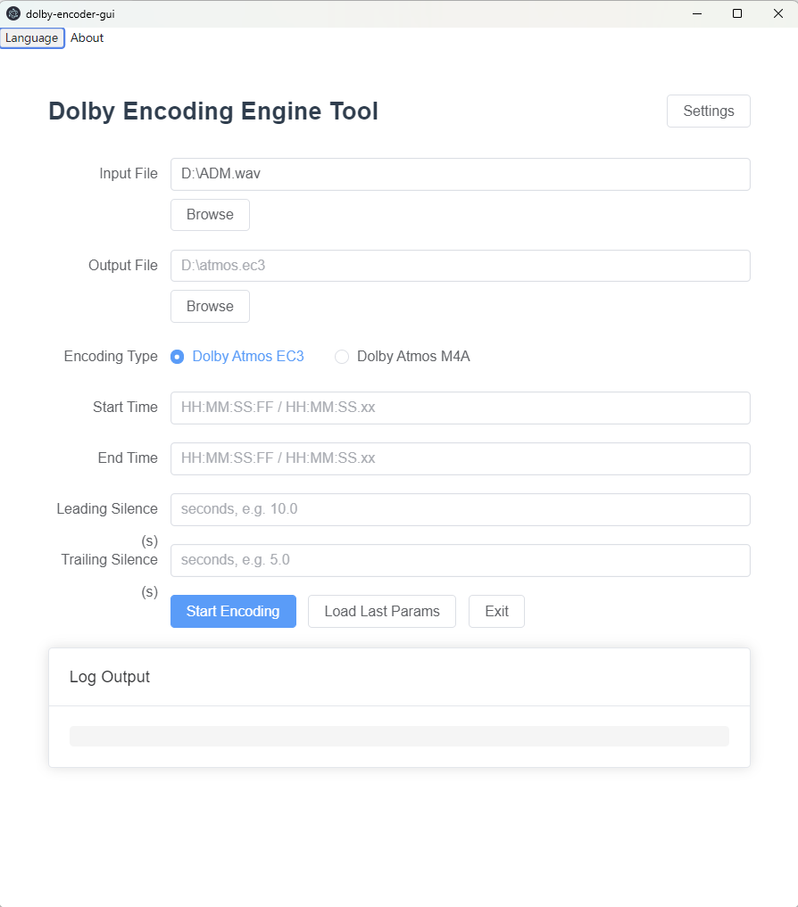
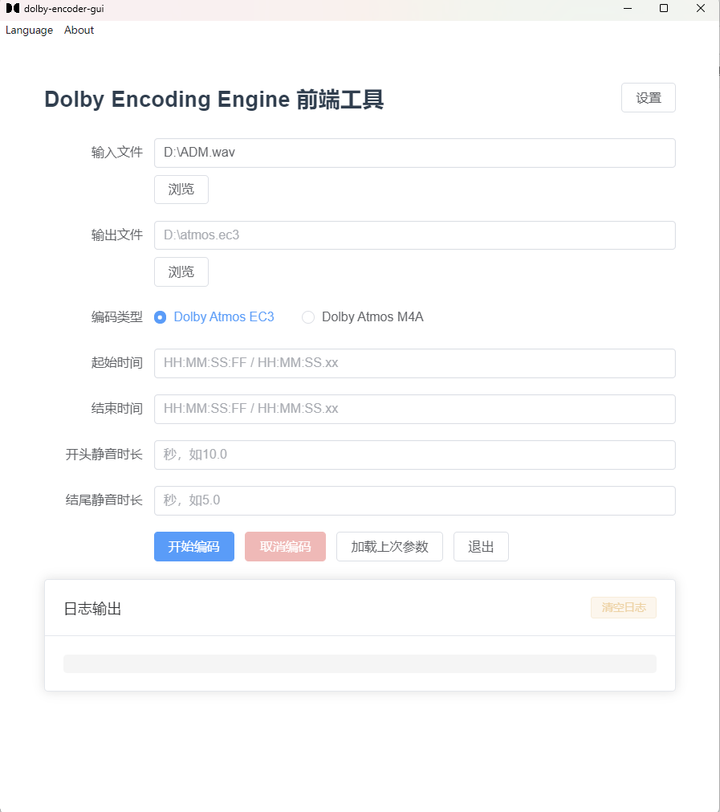
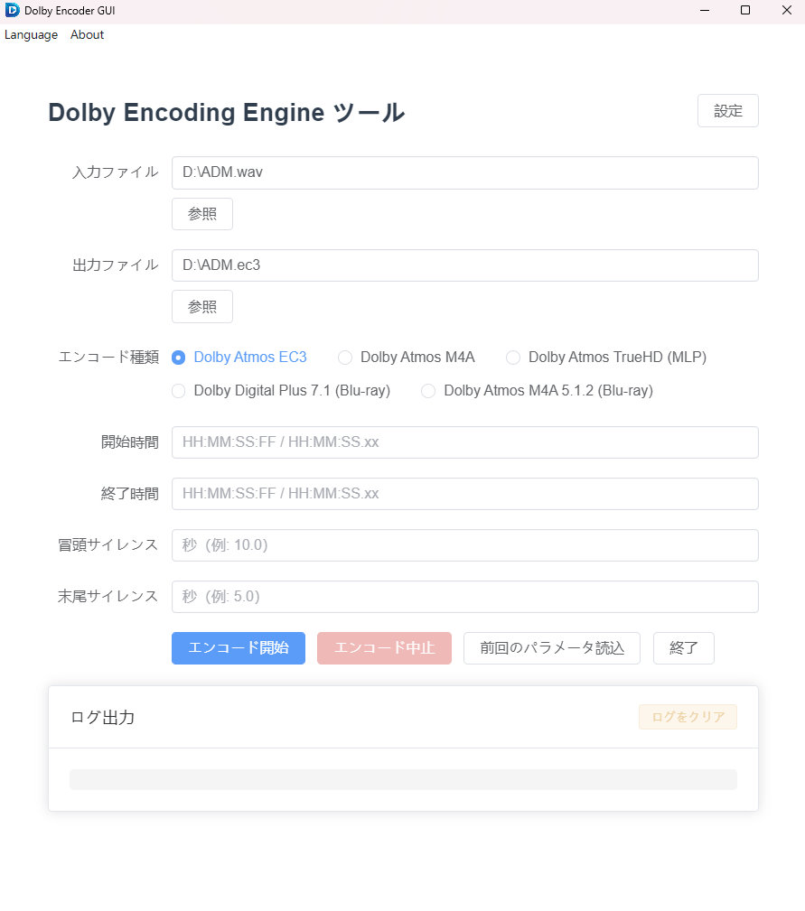

<div align="center">
  
</div>

# Dolby Encoder GUI

[](./dist_electron)
[](https://www.electronjs.org/)
[](https://vuejs.org/)
[](https://www.python.org/)
[](./LICENSE)

[English](#dolby-encoder-gui) | [简体中文](#dolby-encoder-gui-1) | [日本語](#dolby-encoder-gui-2)

A open-source GUI for Dolby Encoding Engine (DEE).<br>
Designed for creators who need an easier way to render ADM BWF projects into TrueHD, DD+, or EAC3-JOC deliverables — without touching the command line.

---

## 🔍 At a Glance

| Capability | Details |
| --- | --- |
| Supported inputs | ADM BWF (Atmos mixes) |
| Output workflows | Atmos EC3 · Atmos M4A · Atmos TrueHD (MLP) · Dolby Digital Plus 7.1 for Blu-ray<br>· Dolby Atmos M4A 5.1.2 for Blu-ray |
| OS target | Windows (Electron build) |
| Core engine | Dolby Encoding Engine 5.x (`dee.exe`) |
| Extra tooling | `deew` Python package · `deezy` CLI · `ffmpeg` for final mux |
| Languages | English · Chinese · Japanese |

---

## ✨ Key Features

- Real-time log streaming and progress bar synced with `dee.exe` output.
- Settings dialog to persist the Dolby engine root (`dee.exe` + `xml_templates`).
- Parameter persistence (`last_params.txt`) to restore the latest successful encode.
- Post-processing pipeline for Blu-ray: run `deew`/`deezy` → clean intermediates → remux with `ffmpeg` → final `.m4a`.
- Multilingual UI toggle (English / Chinese / Japanese) with quick keyboard shortcuts.

---

## 📦 Requirements

- **Node.js 16+** and npm for development / packaging.
- **deew** – available in two ways:
  - Preferred: Place `deew.exe` in PATH (single-file executable).
  - Fallback: Install via `pip install deew` (requires Python 3.9+ accessible via `python` or `py` on PATH).
  - ⚠️ **First-time setup**: On first run, `deew` opens a command-line configuration prompt asking for the Dolby Encoding Engine folder path and the `ffmpeg` path.
- **deezy** – install the CLI and keep `deezy` (or `deezy.exe`) on PATH so the app can invoke it directly.
- **ffmpeg** – ensure the binary is present on PATH.
- **Dolby Encoding Engine** (DEE 5.1–5.2). Keep its `dee.exe`, `xml_templates/`, `DolbyTemp/` folders intact.

> 📝 `encode.exe` ships with the project. Rebuild it only when you change `encode.c` or need a custom toolchain.

---

## 🚀 Quick Start

```bash
# 1. Install UI dependencies
npm install

# 2. Launch the development build
npm run electron:serve

# 3. Package for production
npm run electron:build
```

1. Place/keep `encode.exe` in the repo root (already provided).
2. Ensure the Dolby Encoding Engine assets exist on disk (e.g. `D:\Dolby_Encoding_Engine`).
3. In the app, open **Settings → Engine Directory** and browse to the DEE root.
4. (Optional) Set `ENCODE_PATH` if you keep `encode.exe` elsewhere:
   ```cmd
   set ENCODE_PATH=D:\tools\encode.exe
   ```
5. Provide ADM WAV input + output name, pick the workflow, hit **Start Encoding**.

During the Blu-ray profiles, the UI holds at 99% with a "converting" toast while `deew`/`deezy` and `ffmpeg` finish. When everything succeeds you’ll see `Encoding finished, exit code: 0` and the progress bar snaps to 100%.

### ▶ One‑click launch (Windows)

Once the environment is ready (DEE root selected, and `deew`/`deezy`/`ffmpeg` are on PATH), you can launch the app by double‑clicking:

- `One click launch GUI.bat` (in the repository root)

## 📸 Screenshots

 

---

## ⚙️ Configuration Tips

- **Engine Directory** – stored in Electron user-data. Change it via Settings without editing env vars.
- **Language menu** – `Ctrl/Cmd+Shift+E` (English) · `Ctrl/Cmd+Shift+C` (Chinese) · `Ctrl/Cmd+Shift+J` (Japanese).
- **Paths** – avoid double quotes in file paths; the UI guards against illegal characters.
- **Bitrate** – All output formats are encoded at the maximum bitrate supported by each format for optimal quality.
- **Temp cleanup** – Blu-ray workflows remove intermediate `.mlp/.eb3/.mll/.log/.ec3` files automatically.
- **deew first-run setup** – When `deew` runs for the first time, it pops up a command-line prompt that collects the Dolby Encoding Engine folder path and the `ffmpeg` path. Complete this one-time setup before encoding.
- **deezy availability** – Make sure `deezy` resolves from PATH; no additional configuration is required beyond installing the CLI.

---

## 🧪 Troubleshooting

- Progress stuck at 0% ➜ check `dee.exe` logs still emit `Overall progress:` lines.
- `deew` execution fails ➜ ensure either `deew.exe` is in PATH, or Python 3.9+ with `deew` package installed (`pip install deew`) is accessible on PATH. On first run, complete the configuration dialog that prompts for Dolby Encoding Engine and ffmpeg paths.
- `deezy` execution fails ➜ confirm the CLI is installed and the `deezy` command is reachable from PATH.
- `ffmpeg` header error ➜ confirm you're using a build that supports `-c:a copy` with E-AC-3 inside MP4 (`ffmpeg` 5.x/6.x works).
- Need a fresh start ➜ delete `last_params.txt` in the project root.
- **⚠️ Dolby Atmos M4A 5.1.2 for Blu-ray format limitation** – This output format is technically a 7.1 Dolby Atmos track, but Dolby Encoding Engine will "fold" the rear surround channels (Lb, Rb) into top-front channels (Tfl, Tfr) during encoding. Currently, only Dolby-licensed Blu-ray players can correctly decode and remap this layout back to standard 7.1 channels. On other devices (PCs, mobile devices, etc.), the track is interpreted as 5.1.2, causing the rear channels to be incorrectly mapped to overhead speakers. In terms of listening experience, there is minimal rear sound, with only the front channels properly mapped. Therefore, this format is currently only suitable for licensed Blu-ray players to achieve correct 7.1 channel rendering.

---

## ⚖️ Legal Notice

- This project is not affiliated with or endorsed by Dolby Laboratories.
- “Dolby”, “Dolby Atmos”, “Dolby TrueHD”, and “Dolby Digital Plus (DD+)” are registered trademarks of Dolby Laboratories Licensing Corporation.
- This software does not contain or redistribute any proprietary Dolby components — it only provides a graphical user interface for users who already have access to official Dolby command-line tools.

---

## 🤝 Credits

- Dolby Encoding Engine (commercial software) for the core transcodes.
- [deew](https://github.com/pcroland/deew) for the open-source wrapper enabling the Blu-ray Dolby Digital Plus pipeline.
- [deezy](https://github.com/jessielw/DeeZy) for the Atmos Blu-ray remux helper.
- ffmpeg project for the MP4 remuxing stage.

---

# Dolby Encoder GUI

[English](#dolby-encoder-gui) | [简体中文](#dolby-encoder-gui-1) | [日本語](#dolby-encoder-gui-2)

用于杜比编码引擎 （DEE） 工作流程的开源GUI。
专为需要更简单的方式将 ADM BWF 项目渲染为 TrueHD、DD+ 或 EAC3-JOC 可交付成果的创作者而设计，而无需接触命令行。

---

## 🔍 概览

| 功能 | 详情 |
| --- | --- |
| 支持的输入 | ADM BWF（Atmos 混音） |
| 输出工作流 | Atmos EC3 · Atmos M4A · Atmos TrueHD (MLP) · Dolby Digital Plus 7.1 for Blu-ray<br>· Dolby Atmos M4A 5.1.2 for Blu-ray |
| 目标操作系统 | Windows（Electron 构建） |
| 核心引擎 | Dolby Encoding Engine 5.x (`dee.exe`) |
| 额外工具 | `deew` Python 包 · `deezy` CLI · `ffmpeg` 用于最终封装 |
| 语言 | 英语 · 中文 · 日语 |

---

## ✨ 功能亮点

- 实时跟踪 `dee.exe` 日志及进度条。
- 设置可持久化保存 Dolby 引擎根目录路径。
- `last_params.txt` 自动记录最近一次成功参数。
- Blu-ray 流程自动调用 `deew`/`deezy` → 清理中间文件 → `ffmpeg` 重新封装为 `.m4a`。
- 支持中英日界面，一键切换。

## 📦 环境依赖

- **Node.js 16+** 与 npm。
- **deew** – 支持两种使用方式：
  - 推荐方式：将 `deew.exe` 添加到 PATH 环境变量中（单文件可执行程序）。
  - 备选方式：通过 `pip install deew` 安装（需要 Python 3.9+ 且 `python`/`py` 命令可用）。
  - ⚠️ **首次配置**：首次运行 `deew` 时会在命令行中弹出路径配置对话行，需要填写 Dolby Encoding Engine 文件夹路径和 ffmpeg 路径。
- **deezy** – 确保 `deezy`项目已加入 PATH，应用即可直接调用。
- **ffmpeg**（需添加至 PATH）。
- **Dolby Encoding Engine**（存放 `dee.exe` 与其 `xml_templates/`、`DolbyTemp/` 等目录）。

## 🚀 快速上手

```bash
npm install
npm run electron:serve
# 或打包发行
npm run electron:build
```

1. 仓库已提供 `encode.exe`，无需另行放置。
2. 确保本地已安装 Dolby Encoding Engine，例如 `D:\Dolby_Encoding_Engine`。
3. 打开应用 → **设置 → dee 目录**，选择上述根目录。
4. （可选）若自定义 `encode.exe` 路径，可设置环境变量：
   ```cmd
   set ENCODE_PATH=D:\路径\encode.exe
   ```
5. 选择 ADM WAV 输入、输出文件名，挑选所需编码流程并开始。

Blu-ray 流程中，进度条会在 99% 停留并提示“正在转换…”，待 `deew`/`deezy` 与 `ffmpeg` 完成后才显示 100%。

### ▶ 一键启动（Windows）

当环境准备完成（已选择 DEE 根目录，且 `deew`/`deezy`/`ffmpeg` 已加入 PATH）时，可直接双击仓库根目录的批处理脚本启动应用：

- `One click launch GUI.bat`

## 📸 截图



## ⚙️ 配置说明

- **dee 目录** 通过设置界面修改，无需手动编辑配置文件。
- **语言切换** 快捷键：`Ctrl/Cmd+Shift+E`（英文）、`Ctrl/Cmd+Shift+C`（中文）、`Ctrl/Cmd+Shift+J`（日文）。
- **路径合法性**：UI 会校验双引号等非法字符，避免编解码失败。
- **码率**：所有输出格式均以该格式所支持的最高码率进行编码，以确保最佳音质。
- **临时文件**：Blu-ray 流程结束后会自动删除 `.mlp/.eb3/.ec3/.mll/.log` 等中间文件。
- **deew 首次配置**：首次运行 `deew` 时会在命令行中弹出路径配置对话行，要求填写 Dolby Encoding Engine 文件夹路径和 ffmpeg 路径，完成此一次性配置后才能正常编码。
- **deezy 命令**：确认 `deezy` 命令可在命令行直接执行，无需额外配置。

## 🧪 常见问题

- 进度条停在 0% ➜ 确认 `dee.exe` 日志仍输出 `Overall progress:`。
- `deew` 执行失败 ➜ 确认已将 `deew.exe` 添加至 PATH 环境变量，或已安装 Python 3.9+ 并通过 `pip install deew` 安装 deew 包。首次运行时会弹出配置对话框，需要填写 Dolby Encoding Engine 和 ffmpeg 路径。
- `deezy` 执行失败 ➜ 检查 `deezy` 命令可在 PATH 中找到。
- `ffmpeg` 报头部错误 ➜ 使用支持 E-AC-3 copy 的 `ffmpeg` 版本并确保在PATH环境变量中。
- 重置参数 ➜ 删除项目根目录下的 `last_params.txt`。
- **⚠️ Dolby Atmos M4A 5.1.2 for Blu-ray 格式限制**：此输出格式本质上是 7.1 声道的 Dolby Atmos 音轨，但 Dolby Encoding Engine 在编码过程中会将后置环绕声道（Lb, Rb）“折叠”为前上方天空声道（Tfl, Tfr）。目前只有杜比授权的蓝光播放器才能正确解码并将此布局还原为标准的 7.1 声道。在其他设备（PC、移动设备等）上，该音轨会被识别为 5.1.2，导致后置声道被错误映射到前上方天空声道，就听感而言，后方几乎没有声音，只有正面声道正常映射。因此此格式实际上目前仅适用于获得授权的蓝光播放器才能得到正确的 7.1 声道渲染效果。

## ⚖️ 法律声明

- 该项目不隶属于杜比实验室，也不受杜比实验室认可。
- “杜比”、“杜比全景声”、“杜比 TrueHD”和“杜比数字增强 （DD+）”是杜比实验室许可公司的注册商标。
- 该软件不包含或重新分发任何专有的杜比组件——它仅为已经有权访问官方杜比命令行工具的用户提供图形用户界面。

## 🤝 鸣谢

- Dolby Encoding Engine（商业软件）。
- [deew](https://github.com/pcroland/deew) 开源项目提供了 Blu-ray 流程核心能力。
- [deezy](https://github.com/jessielw/DeeZy) 提供 Atmos Blu-ray 封装辅助。
- ffmpeg 项目提供 MP4 重封装能力。

---

# Dolby Encoder GUI

[English](#dolby-encoder-gui) | [简体中文](#dolby-encoder-gui-1) | [日本語](#dolby-encoder-gui-2)

Dolby エンコーディングエンジン（DEE）ワークフロー用のオープンソース GUI です。<br>
コマンドラインに触れることなく、ADM BWF プロジェクトを TrueHD、DD+、または EAC3-JOC で出力するための簡単な方法を提供するクリエイターのために設計されています。

---

## 🔍 概観

|機能|詳細|
|---|---|
|サポートされている入力|ADM BWF（Atmosミックス）|
|出力ワークフロー|Atmos EC3 · Atmos M4A · Atmos TrueHD (MLP) · Blu-ray 用の Dolby Digital Plus 7.1<br>· Blu-ray 用の Dolby Atmos M4A 5.1.2|
|対象OS|Windows（Electronビルド）|
|コアエンジン|Dolby Encoding Engine 5.x (`dee.exe`)|
|追加ツール|`deew` Python パッケージ · `deezy` CLI · 最終的なマルチプレックス用の `ffmpeg`|
|言語|英語 · 中国語 · 日本語|

---

## ✨ 主な機能

- `dee.exe` 出力に同期したリアルタイムログストリーミングと進行状況バー。
- Dolby エンジンのルートディレクトリ（`dee.exe` + `xml_templates`）を保持するための設定ダイアログ。
- 最後の成功したエンコードを復元するためのパラメータ持続（`last_params.txt`）。
- Blu-ray 用のポストプロセッシングパイプライン：`deew` / `deezy` を実行 → 中間ファイルをクリーンアップ → `ffmpeg` で最終 `.m4a` に再マルチプレックス。
- 多言語 UI トグル（英語 / 中国語 / 日本語）およびクイックキーボードショートカット。

## 📦 要件

- **Node.js 16+** および開発用の npm。
- **deew** – 2 つの方法で利用可能：
  - 推奨：`deew.exe` を PATH に配置（単一ファイルの実行可能ファイル）。
  - フォールバック：`pip install deew` でインストール（Python 3.9+ が `python` または `py` でアクセス可能である必要があります）。
  - ⚠️ **初回セットアップ**：初回実行時、`deew` がコマンドライン設定プロンプトを開き、Dolby Encoding Engine フォルダパスと `ffmpeg` パスを尋ねます。
- **deezy** – CLI をインストールし、アプリが直接呼び出せるように `deezy`（または `deezy.exe`）を PATH に保持。
- **ffmpeg** – バイナリが PATH に存在していることを確認します。
- **Dolby Encoding Engine** （DEE 5.1–5.2）。その `dee.exe`、`xml_templates/`、`DolbyTemp/` フォルダをそのまま保持します。

> 📝 `encode.exe` はプロジェクトと共に提供されています。`encode.c` を変更するか、カスタムツールチェインが必要な場合にのみ再構築してください。

---

## 🚀 クイックスタート

```bash
# 1. UI の依存関係をインストール
npm install

# 2. 開発ビルドを起動
npm run electron:serve

# 3. 本番用にパッケージ化
npm run electron:build
```

1. `encode.exe` をリポジトリのルートに置く/保持します（既に提供されています）。
2. Dolby Encoding Engine 資産がディスクに存在することを確認します（例： `D:\Dolby_Encoding_Engine`）。
3. アプリで **設定 → エンジンディレクトリ** を開き、DEE のルートを参照します。
4. （オプション）`encode.exe` を他の場所に配置している場合は、`ENCODE_PATH` を設定します：
   ```cmd
   set ENCODE_PATH=D:\tools\encode.exe
   ```
5. ADM WAV 入力 + 出力名を提供し、ワークフローを選択し、**エンコード開始** をクリックします。

Blu-ray プロファイルの間、UI は 99% で保持され、「変換中」のトーストが表示されます。`deew` / `deezy` および `ffmpeg` が完了すると、すべてが成功したことが表示されます。

### ▶ ワンクリックランチ（Windows）

一度環境が準備でき（DEE ルートが選択され、`deew` / `deezy` / `ffmpeg` が PATH に追加されたら）、アプリをダブルクリックで起動できます：

- `One click launch GUI.bat`（リポジトリのルートにあります）

## 📸 スクリーンショット



---

## ⚙️ 設定のヒント

- **エンジンディレクトリ** – Electron ユーザーデータに保存されます。設定を変更することで、環境変数を編集せずに変更できます。
- **言語メニュー** – `Ctrl/Cmd+Shift+E`（英語） · `Ctrl/Cmd+Shift+C`（中国語） · `Ctrl/Cmd+Shift+J`（日本語）。
- **パス** – ファイルパス内のダブルクオーテーションを避けてください； UI は不正な文字から保護します。
- **ビットレート** – すべての出力フォーマットは、各フォーマットがサポートする最大ビットレートでエンコードされ、最適な品質を確保します。
- **一時クリーンアップ** – Blu-ray ワークフローは、`mlp` / `eb3` / `mll` / `log` / `ec3` などの中間ファイルを自動的に削除します。
- **deew 最初の実行セットアップ** – `deew` が初めて実行される際、コマンドラインプロンプトが表示され、Dolby Encoding Engine フォルダのパスと `ffmpeg` パスを求められます。この一度の設定を完了した後にエンコードが開始されます。
- **deezy の可用性** – `deezy` が PATH から問題なく解決されることを確認します。CLI をインストールすることで、追加設定は必要ありません。

---

## 🧪 トラブルシューティング

- 進行状況が 0% で停止します ➜ `dee.exe` のログが `Overall progress:` 行を出力しているか確認してください。
- `deew` の実行が失敗します ➜ `deew.exe` が PATH に追加されているか、Python 3.9+ がインストールされ、`pip install deew` で `deew` パッケージが利用できるか確認してください。初回実行時に、Dolby Encoding Engine と `ffmpeg` パスを求める設定ダイアログが表示されます。
- `deezy` 実行が失敗します ➜ CLI がインストールされており、`deezy` コマンドが PATH からアクセス可能か確認してください。
- `ffmpeg` ヘッダーエラー ➜ `ffmpeg` 5.x/6.x を使用して E-AC-3 を MP4 に含められるビルドを使用しているか確認してください。
- 新たなスタートが必要 ➜ プロジェクトルートの `last_params.txt` を削除してください。
-  **⚠️ Dolby Atmos M4A 5.1.2 の Blu-ray フォーマットにおける制限事項** この出力フォーマットは技術的には 7.1 Dolby Atmos トラックですが、Dolby Encoding Engine はエンコード時にリアサラウンドチャンネル (Lb、Rb) をトップフロントチャンネル (Tfl、Tfr) に「折り畳み」ます。現在、Dolby ライセンスを取得した Blu-ray プレーヤーのみが、このレイアウトを標準の 7.1 チャンネルに正しくデコードして再マッピングできます。その他のデバイス (PC、モバイルデバイスなど) では、トラックは 5.1.2 として解釈され、リアチャンネルがオーバーヘッドスピーカーに誤ってマッピングされます。リスニング体験の点では、リアサウンドは最小限に抑えられ、フロントチャンネルのみが正しくマッピングされます。そのため、このフォーマットは現在、ライセンスを取得した Blu-ray プレーヤーでのみ、正しい 7.1 チャンネルレンダリングを実現できます。

---

## ⚖️ 法律通知

- このプロジェクトは Dolby Laboratories とは無関係であり、Dolby Laboratories によって承認されていません。
- “Dolby”、“Dolby Atmos”、“Dolby TrueHD”、および“Dolby Digital Plus (DD+)”は Dolby Laboratories Licensing Corporation の登録商標です。
- このソフトウェアには、いかなる専有の Dolby コンポーネントも含まれず、再配布されません。公式の Dolby コマンドラインツールにアクセス権を持つユーザーのためのグラフィカルユーザーインターフェースを提供するのみです。

---

## 🤝 クレジット

- Dolby Encoding Engine（商業ソフトウェア）。
- [deew](https://github.com/pcroland/deew) は、Blu-ray ワークフローを可能にするオープンソースラッパーです。
- [deezy](https://github.com/jessielw/DeeZy) は Atmos Blu-ray 再マルチプレックスヘルパーです。
- ffmpeg プロジェクトは、MP4 再マルチプレックスステージを提供します。

---

> MIT License · Feel free to fork, tweak, and contribute improvements. Pull requests and issue reports are welcome! 🎧
